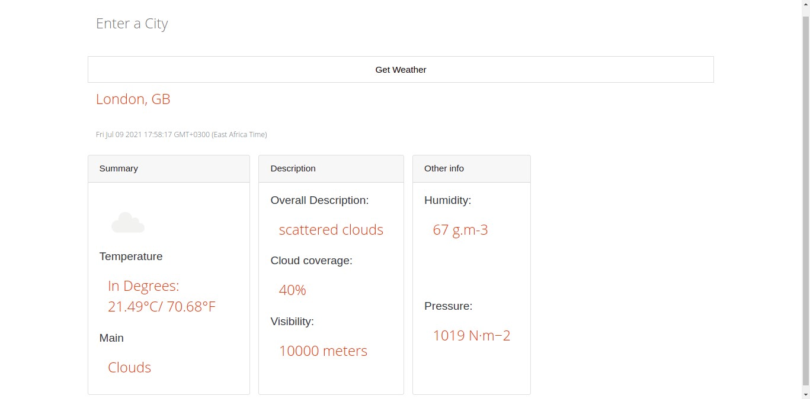

# Openweathermap API Node.js
This is a simple Node.js application which consumes the Openweathermap API to display the weather details. It is consumable and fantastic!

## LICENSE

License: [MIT](licencse)

## Final product

